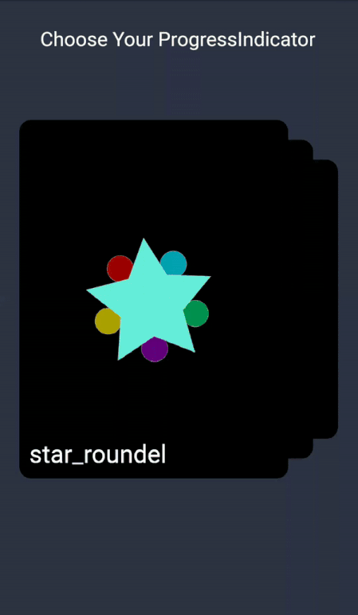

# flutter_create
This submission's main goal is to provide the user with the choice of having their own Progress Indicator from
a lot of custom made animations(Here, the animations are made using Flare(by 2Dimensions)).

The carousel in the opening of the app gives the choice of some animations, that can be used as the default Progress Indicator,
This can be stored in variable and then can be further used for showing preogress indicators instead of the default progress indicator
that Android or iOS provides.

# Something Different

Since there was a limit to the dart file size, the documentation of the dart code has been shifted mainDocumented.txt file

and the widget_test.dart file has its code written in the widget_test.txt file. If required it can be changed to .dart file.

# Demo

